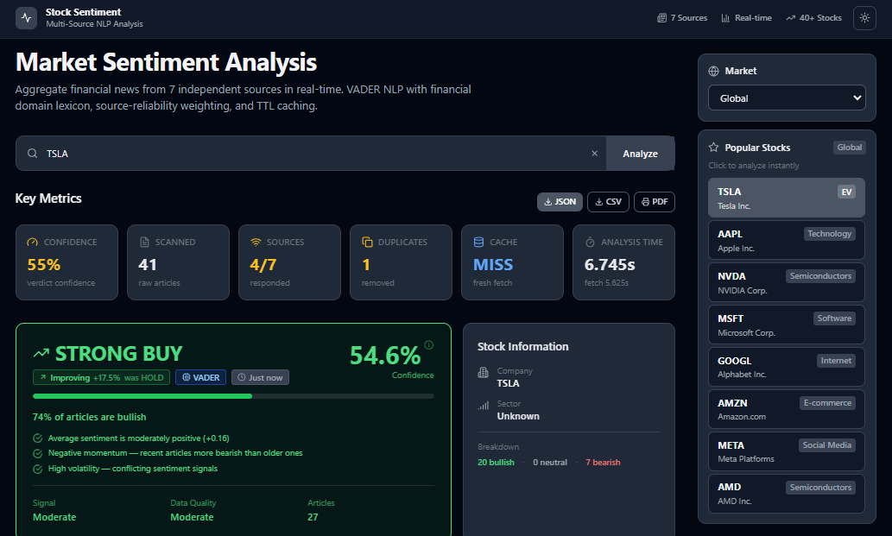
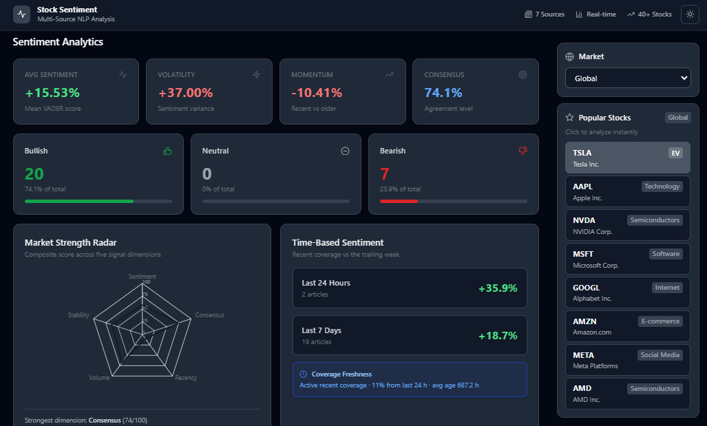
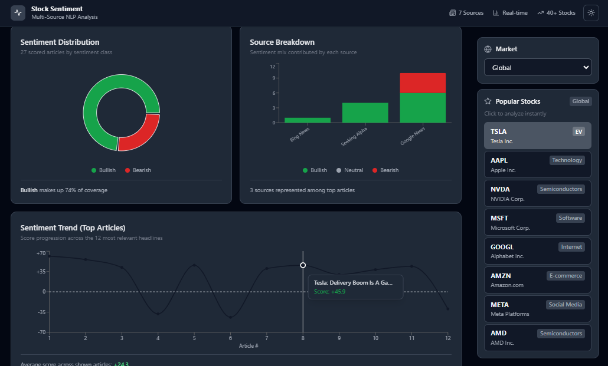
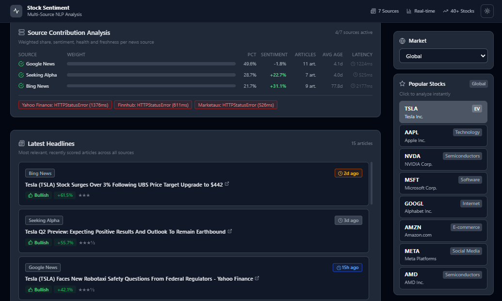

# Stock Sentiment Analyzer

[](https://github.com/guru-bharadwaj20/Sentiment_Stock_Analysis/actions/workflows/ci.yml)
[](https://www.python.org/)
[](https://fastapi.tiangolo.com/)
[](https://react.dev/)
[](https://nodejs.org/)
[](LICENSE)
[](docker-compose.yml)

Real-time market sentiment analysis that aggregates news from 7 concurrent sources, scores it with a finance-tuned VADER model, and turns it into a single BUY/SELL/HOLD verdict with full source-level transparency.

<p align="center">
  
  
</p>
<p align="center">
  
  
</p>

---

## Overview

The system fetches news in parallel from 7 independent sources, fuzzy-deduplicates repeated stories, scores each article with a domain-enhanced VADER model, and aggregates everything into a verdict with reasoning, per-source contribution, and trend tracking — typically 5–10 s on first fetch, < 1 ms on cache hit.

| Feature | Implementation |
|---------|---------------|
| Concurrent fetching | `httpx.AsyncClient` + `asyncio.gather` across 7 sources, with per-source health/timing |
| Deduplication | MD5 exact hash + `SequenceMatcher` fuzzy match (0.82 threshold) |
| Financial NLP | VADER lexicon extended with 40+ finance terms; headline 40% / description 60% weighting |
| Dual-mode sentiment | VADER (default, ~1 ms/article) or FinBERT via `SENTIMENT_MODEL=finbert` |
| Confidence model | 6-factor weighted formula (magnitude, consensus, volume, source quality, recency, stability) |
| Trend tracking | Compares current run vs. last SQLite entry — improving / deteriorating / stable |
| Background scheduler | Hourly async refresh of pre-warmed tickers, skipping cache-fresh entries |
| Export | JSON / CSV / print-to-PDF, entirely client-side |
| Dark mode | System-preference-aware, persisted to `localStorage` |
| Container-ready | Dockerfile (backend + frontend) + `docker-compose.yml`, with CI: lint → test → build → smoke test |

---

## Architecture

```
React (Vite + Tailwind + Recharts)
        │  GET /analyze/{ticker}
        ▼
FastAPI  ──▶ TTL cache hit? return in < 1 ms
        │
        ▼  asyncio.gather across 7 httpx fetchers
   Google News · Bing News · Yahoo Finance · Finnhub
   Marketaux · Seeking Alpha · Alpha Vantage
        │
        ▼  MD5 + fuzzy dedup
   VADER score × recency weight × source weight
        │
        ▼
   aggregate → verdict + confidence + trend (vs. SQLite history)
        │
        ▼
   SQLite persist · TTL cache set · response
```

A background `asyncio` task refreshes a set of pre-configured tickers every 60 minutes.

---

## Tech Stack

**Backend:** FastAPI · Uvicorn · httpx · vaderSentiment · BeautifulSoup4 · feedparser · Pydantic v2 · SQLite

**Frontend:** React 18 · Vite · Tailwind CSS · Recharts · Axios · Lucide React

---

## Project Structure

```
Sentiment_Stock_Analysis/
├── docker-compose.yml
├── .github/workflows/ci.yml
├── backend/
│   ├── main.py, config.py, scheduler.py
│   ├── api/routes.py            # /analyze, /history, /cache, /scheduler/status
│   ├── models/schemas.py        # Pydantic response models
│   ├── fetchers/sources.py      # 7 async fetchers
│   ├── services/                # analyzer, sentiment, cache, dedup
│   ├── db/history.py            # SQLite persistence
│   └── tests/                   # 42 pytest cases
└── frontend/
    └── src/
        ├── hooks/                # useAnalysis, useTheme, useRecentSearches
        ├── services/api.js
        └── components/
            ├── SearchBar.jsx, Sidebar.jsx, LoadingSkeleton.jsx
            └── Dashboard/        # VerdictCard, AnalyticsCards, MetricCards,
                                   # SourceContribution, Charts, Headlines
```

---

## Quick Start

### Docker (recommended)

```bash
git clone https://github.com/guru-bharadwaj20/Sentiment_Stock_Analysis
cd Sentiment_Stock_Analysis
docker compose up --build
```

- Frontend → http://localhost:3000
- Backend API → http://localhost:8000
- Swagger docs → http://localhost:8000/docs

### Local dev

```bash
# Backend
cd backend
python -m venv venv && source venv/bin/activate   # Windows: venv\Scripts\activate
pip install -r requirements.txt
uvicorn main:app --reload      # http://localhost:8000

# Frontend (separate terminal)
cd frontend
npm install
npm run dev                    # http://localhost:5173
```

```bash
# Tests
cd backend
pip install -r requirements-dev.txt
pytest tests/ -v
```

No API keys required. Both servers must run simultaneously.

### Key environment variables

| Variable | Default | Description |
|----------|---------|-------------|
| `CACHE_TTL` | `300` | Cache TTL in seconds |
| `SCHEDULER_ENABLED` | `true` | Enable background refresh |
| `SCHEDULED_TICKERS` | `TSLA,AAPL,...` | Tickers to pre-warm |
| `SENTIMENT_MODEL` | `vader` | `vader` or `finbert` |
| `VITE_API_URL` | `http://localhost:8000` | Backend URL for the frontend |

See `.env.example` / `config.py` for the full list.

---

## API Reference

**`GET /analyze/{ticker}`** — full sentiment analysis (cached 5 min per ticker):

```json
{
  "ticker": "TSLA",
  "verdict": "BUY",
  "confidence_score": 64.3,
  "trend": { "direction": "improving", "sentiment_delta": 0.0842 },
  "source_contributions": { "Finnhub": { "articles": 8, "avg_sentiment": 0.42, "contribution_pct": 31.2 } },
  "stats": { "bullish": 22, "bearish": 6, "neutral": 3 },
  "cached": false
}
```

Also available: `GET /history/{ticker}`, `DELETE /cache`, `GET /scheduler/status`.

---

## Methodology

**Verdict thresholds** (mean weighted sentiment): `> 0.20` Strong Buy · `0.05–0.20` Buy · `−0.05–0.05` Hold · `−0.20–−0.05` Sell · `< −0.20` Strong Sell

**Source weights** reflect reliability: Finnhub 1.00 · Alpha Vantage 0.95 · Yahoo Finance 0.90 · Seeking Alpha 0.85 · Google News 0.80 · Bing News 0.75 · Marketaux 0.75

**Confidence** combines signal magnitude (35%), consensus (25%), article volume (15%), source quality (10%), recency (10%), and stability (5%) into a single 0–100 score.

---

## Design Decisions

| Decision | Choice | Why |
|----------|--------|-----|
| Async HTTP | httpx + asyncio.gather | True async I/O with a shared connection pool |
| Sentiment | VADER + financial lexicon | FinBERT is 100–500× slower without a GPU; VADER is fast enough at scale |
| Storage | SQLite | Single-file, zero-ops, sufficient for trend history |
| Cache | In-process TTL dict | Zero-latency and correct at single-worker scale; Redis would be overkill |
| Dedup | MD5 exact + fuzzy match | Exact hash catches most duplicates instantly; fuzzy (0.82) catches near-duplicates |

---

## Known Limitations

- In-process cache and SQLite are single-instance — horizontal scaling needs a shared cache/DB.
- No auth or rate limiting on the API; not intended for public exposure without a reverse proxy.
- Sentiment analysis reads headlines/descriptions only, not full article bodies or price data.
- Free-tier news APIs can rate-limit or time out — hence per-source health is surfaced in every response.

---

## License

MIT — see [LICENSE](LICENSE).

## Author

**Guru R Bharadwaj**
[GitHub @guru-bharadwaj20](https://github.com/guru-bharadwaj20) · [LinkedIn](https://www.linkedin.com/in/guru-r-bharadwaj/)
